# Git flow from this project:

## Branches

* `master` é a branch principal, onde o código reflete o que está em produção.
* `develop` é a branch de desenvolvimento, onde o código reflete o que está em homologação.
* `feature/*` são branches de features, onde o código reflete o que está sendo desenvolvido.

## Commits

* Commits devem ser pequenos, frequentes e com mensagens claras.
* Não deve haver commits na branch `master`.
* Não deve haver commits na branch `develop`.

## Pull Requests

Pull Request devem ser feitos em duas situacões:

* Quando uma feature estiver pronta para ser integrada ao `develop`. Neste caso o Pull Request deve ser feito da branch `feature/*` para a branch `develop`. A branch `feature/*` deve ser deletada após o merge.
* Quando a branch `develop` estiver pronta para ser integrada ao `master`. Neste caso o Pull Request deve ser feito da branch `develop` para a branch `master`. A branch `develop` não deve ser deletada após o merge.

## Flow

### Desenvolvendo uma feature

1. Crie uma branch a partir da branch `develop` com o nome `feature/*`.
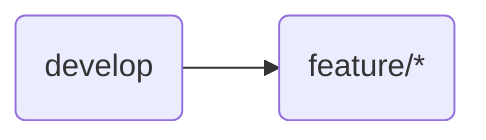
2. Faça commits nessa branch.
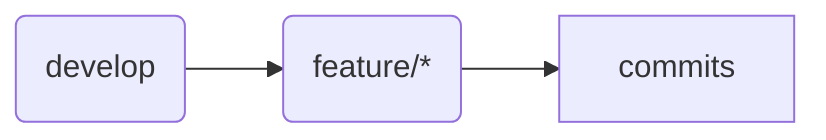
3. Faça Push dessa branch para o repositório remoto ao final do dia.
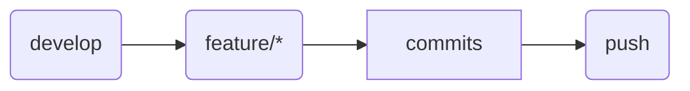
4. Ao concluir a feature, faça um Pull Request da branch `feature/*` para a branch `develop`.
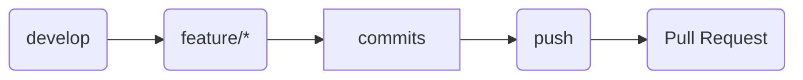
5. Deletar a branch `feature/*` após o merge.
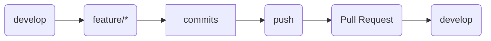

### Enviando uma versão para produção
1. Testar a branch `develop` em homologação.
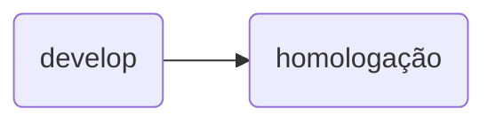
2. Ao concluir os testes, fazer um Pull Request da branch `develop` para a branch `master`.
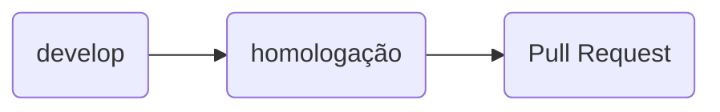
3. Revise o Pull Request.
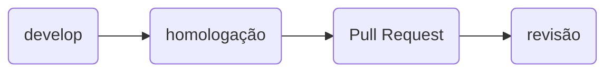
4. Faça o merge.
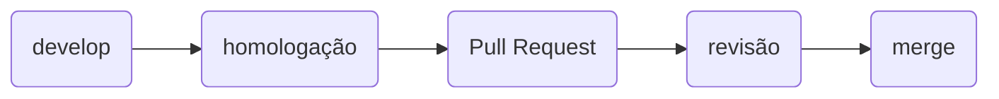
5. Faça o deploy.
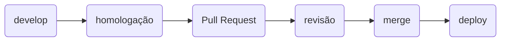
6. Testar a branch `master` em produção.
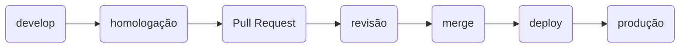